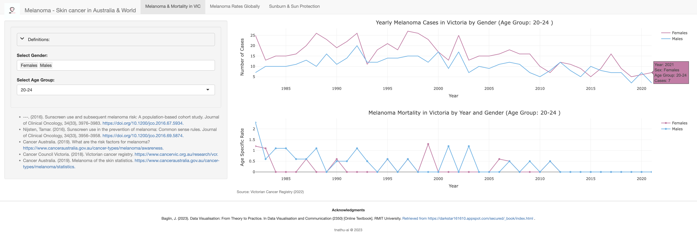

# 🌞 Skin Cancer AU: Melanoma Insights App
📌 Overview
Skin Cancer AU is a Shiny application designed to shed light on melanoma, a critical form of skin cancer, with a keen focus on Victoria, Australia, and global trends. This app aims to visualize various datasets, enhancing understanding and awareness about melanoma statistics, prevention, and trends.

📊 Data Sources
The application utilizes a rich collection of datasets to present a comprehensive view of melanoma trends:

🇦🇺 Incidence and Mortality in Victoria (1982-2021)
🌍 Global Melanoma Rates
🚹🚺 Gender-specific Melanoma Rates Worldwide
☀️ Sunburn and Sun Protection Data
These datasets are meticulously sourced from reputable organizations such as Cancer Victoria, Cancer Council Australia, and Cancer Australia.

🛠️ Data Pre-processing
Data pre-processing and exploratory analysis are key steps in our workflow. Key R libraries like readxl, dplyr, ggplot2, and shiny are employed for these tasks. Our scripts transform raw data into insightful visualizations for the app.

🖥️ Application Structure
The app's backbone consists of two primary R scripts:

server.R: Manages the server-side logic, handling data processing and interactive visualizations.
ui.R: Crafts the user interface, organizing the layout and inputs for an intuitive user experience.
🌟 Key Features
Interactive melanoma incidence and mortality plots for Victoria, with colorblind-friendly design.
Detailed global melanoma rate visualizations.
Informative charts on sunburn and sun protection trends.
User-driven content based on selections like age group and gender.
Educational references and glossary section.
🚀 How to Run
Get started with the Skin Cancer AU app:

Ensure R and Shiny are installed on your system.
Clone or download the app repository.
Open server.R and ui.R in RStudio.
Launch the app with shiny::runApp().

